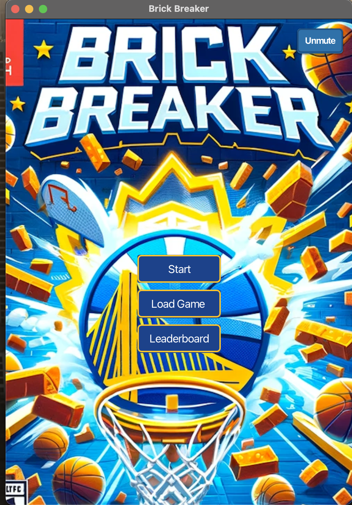
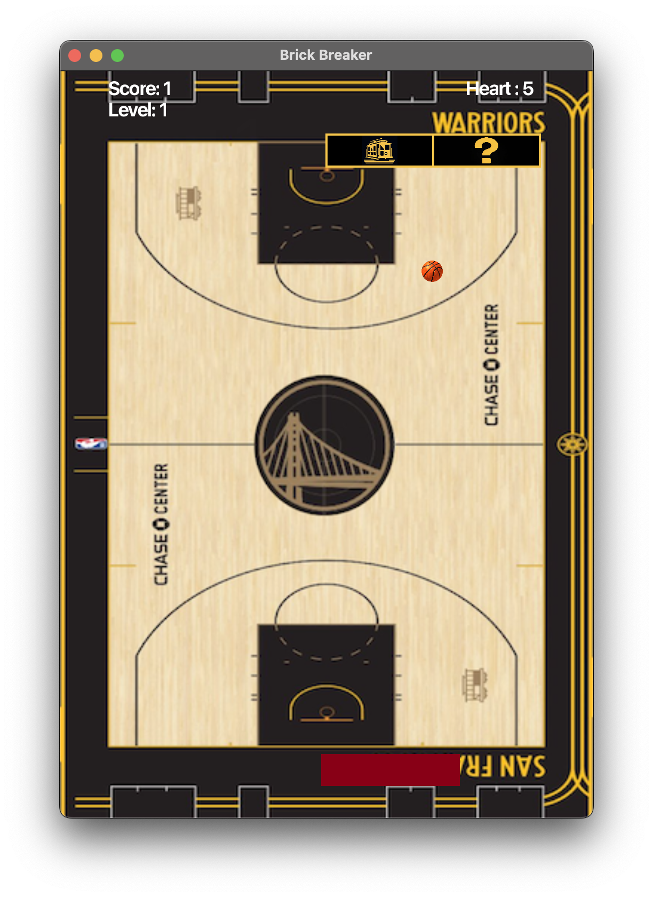
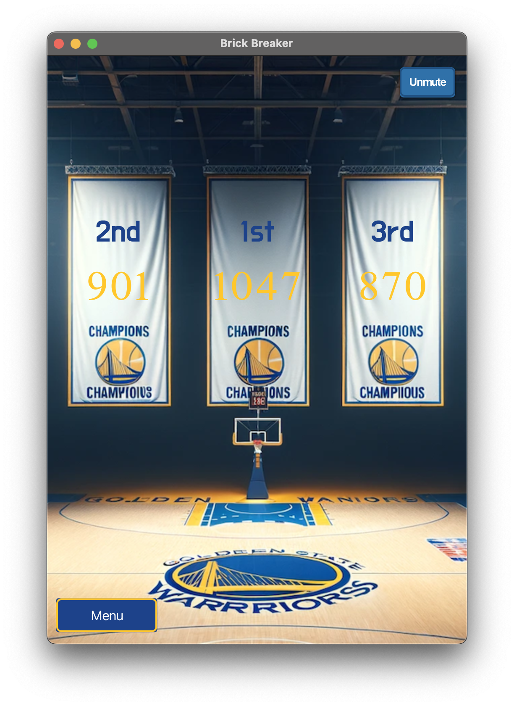
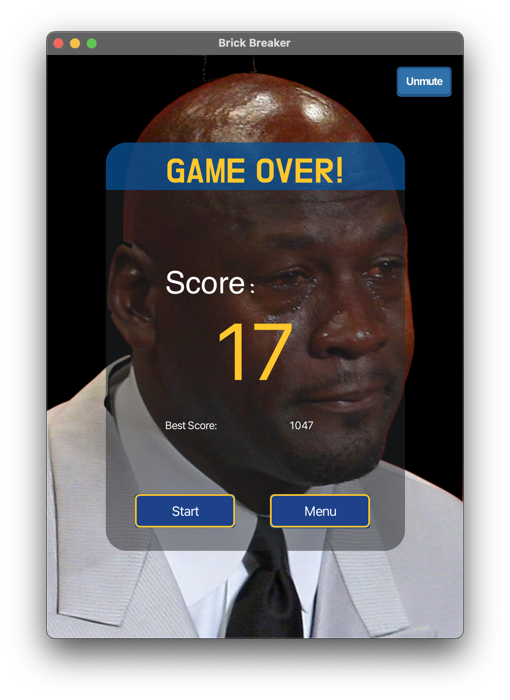
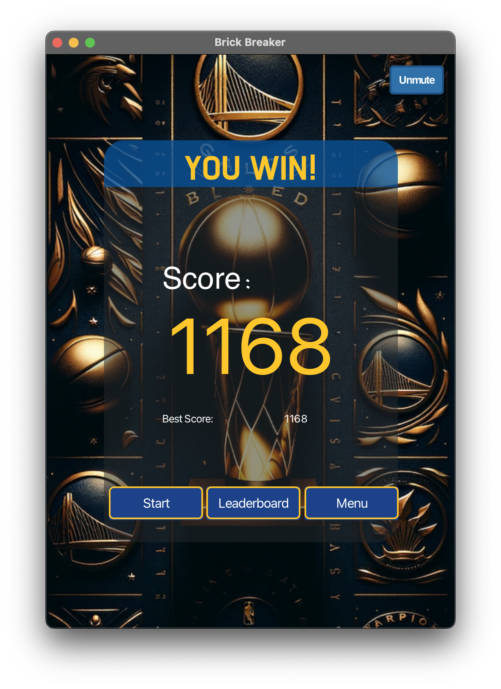
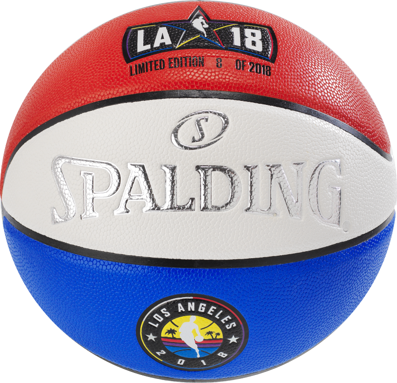

# COMP2042_CW_hcygh2

# Brick Breaker

## 1. Overview

**Title:** Brick Breaker  
**Theme:** NBA Golden State Warriors  
**Genre:** Puzzle / Arcade  
**Platforms:** Java-supported (Windows, macOS, Linux)

**Description:**  
Brick Breaker is an arcade-inspired puzzle game that integrates the excitement of basketball with the strategic play of
brick breaking. The game is themed around the NBA's Golden State Warriors, featuring dynamic visuals and sounds that
capture the essence of the team and the sport.

### 1.1 User Interface

#### 1.1.1 Main Menu Screen

- **Start:** New game at level 1 with 5 lives.
- **Load Game:** Resume a saved game.
- **Leaderboard:** View top scores.
- **Mute/Unmute Button:** Audio control.

#### 1.1.2 Gameplay Screen

- Themed bricks and paddle.
- Score and level indicators.
- Heart icons for lives.

#### 1.1.3 Leaderboard Screen

- **Mute/Unmute Button:** Audio control.
- **Menu:** Back to Main Menu.
- Displays high scores.

#### 1.1.4 Game Over/Win Screens

- **Start:** New game at level 1 with 5 lives.
- **Leaderboard(For Win Screens):** View top scores.
- **Menu:** Back to Main Menu.
- **Mute/Unmute Button:** Audio control.
- Shows current and highest scores.

### 1.2. Gameplay Mechanics

#### 1.2.1 Objective

The primary goal in Brick Breaker is to clear all bricks from the basketball court-themed screen by bouncing a
basketball off a paddle controlled by the player. The game begins at level 1 and progresses through increasingly
challenging levels.

#### 1.2.2 Progression Through Levels

- **Level Design:** Each level introduces a new arrangement of bricks on the court.
- **Level Advancement:** The number of brick rows increases every two levels.
- **Difficulty Increase:** Starting at level 16, lock blocks appear, adding complexity. From level 21, all normal blocks
  are replaced with lock blocks.

#### 1.2.3 Types of Bricks

- **Normal:** Grants 1 point when hit and then disappears.
  

- **Heart:** Adds an extra life (heart) when destroyed
  

- **Mysterious:** Releases a bonus item when hit.
  

- **Star:** Transforms the ball into a Super Ball, during which the player's hearts are not deducted if the ball is
  touch the bottom of screen.
  

- **Lock Block:** Does not break on the first hit; it changes to a different type of brick without awarding points.
  

#### 1.2.4 Scoring System

- **Basic Points:** Hitting any brick, except the lock block, scores 1 point.
- **Heart Bricks:** Players receive an extra life.
- **Super Ball:** No additional points are awarded during Super Ball mode, but it allows for a more aggressive play
  style.
  

- **Bonus Items:**
    - **Increase Bonus:** Adds 3 points to the player's score.
      
      

    - **Decrease Bonus:** Deducts 2 points from the score.
      

    - **Split Ball Bonus:** Creates two additional balls; these do not deduct lives if hit the bottom of screen.
      

#### 1.2.5 Bonus Mechanics

- **Bonus Items:** Drop from mysterious bricks and provide various effects when caught by the paddle.
- **Item Activation:** The effects of bonus items are only activated upon paddle contact.
- **Split Ball Activation:** When the split ball bonus is activated, two new balls are created at the paddle's position.

#### 1.2.6 Game End

The game concludes when the player runs out of lives or clears all the levels. The final score is recorded, and the
player is prompted to enter their name for the leaderboard if their score is high enough.

### 1.3. Saving and Loading

The Brick Breaker game includes a feature to save your gameplay progress at any point during the game. This allows you
to pause your game and resume playing later without losing your progress.

#### 1.3.1 Saving Your Game

- **Method:** Press "S" during gameplay.
- **Confirmation:** On-screen message.
- **Stored Data:** Score, level, hearts(lives), brick state, bonuses, paddle position.

#### 1.3.2 Loading Your Game

- **From Main Menu:** Choose "Load Game."
- **Resume:** Picks up from the last saved state.

#### 1.3.3 Additional Notes

- **Autosave:** This game does not autosave. You must manually save your progress using the "S" key.
- **Multiple Saves:** TCurrently, the game supports only one save file at a time. Saving a new game will overwrite the
  previous save file.
- **Level 26 Saved State:** A saved game state at Level 26 is available, allowing direct access to the game's advanced
  stages.

### 1.4. Sound and Music

The Brick Breaker game is equipped with an immersive audio experience that includes background music and sound effects
that enhance gameplay. Players have the option to mute and unmute the sound according to their preference.

- **In-Game:** "M" key toggles sound.
- **Other Screens:** Clickable mute/unmute button.

### 1.5. Controls and Interactions

- **Paddle Movement:** Left and right arrow keys.
- **Sound Toggle:** "M" key.
- **Save Game:** "S" key.

## 2. Compilation Instructions

### 2.1 Prerequisites

Ensure you have the following installed:

- **Java Development Kit (JDK):** Version 21 or later.
- **Maven:** Often bundled with IDEs like IntelliJ IDEA.
- **IntelliJ IDEA** or a similar IDE with Maven integration.
- **JavaFX Library:** Latest version.

### 2.2 Cloning the Project

- **From Git：** Use git clone [repository URL] to clone the repository.
- **From ZIP File：** 
    1. **Download:** Save "HiiGaryNgoCheong_IntelliJ_21.zip" to your computer.
    2. **Extract:** Unzip to a suitable location.

### 2.3 Importing Project in IntelliJ IDEA

- **First-Time Users：**
    1. Select "Open or Import".
    2. Browse to your project location.
    3. Choose the project's root directory and confirm.
- **Existing Users：**
    1. Go to File > New > Project from Existing Sources...
    2. Browse to your project location.
    3. Choose the project's root directory and confirm.

### 2.4 Resolving Maven Dependencies

Dependencies like SLF4J, Logback, JavaFX modules should auto-resolve. If not, right-click on the project and select
Maven > Reload Project.

### 2.5 Setting Up JDK

**Configure the project to use JDK 21:**

1. In IntelliJ, go to File > Project Structure.
2. Set Project SDK to JDK 21.
3. Ensure Project language level matches JDK 21.

### 2.6 Manual JavaFX Configuration (If Needed)

1. Maven should automatically start downloading the required dependencies specified in your pom.xml file.
2. If it doesn’t, go to the 'Maven' tab on the right-hand side and click on the 'Reload All Maven Projects' icon.

### 2.7 Compiling and Running the Project
- **Maven Command:**
    1. Open Terminal in IntelliJ.
    2. Execute: mvn clean javafx:run.

## 3. Implemented and Working Properly

### 3.1. Separate Screens

The game features distinct screens for gameplay, the main menu, win, game over, and leaderboard. Each screen is designed
to provide a unique user interface appropriate to its function.

### 3.2. Scene Switching

Efficient switching between different game scenes (main menu, gameplay, leaderboard, etc.) is implemented, providing a
seamless transition and enhancing user experience.

### 3.3. High Score Recording

A high score recording mechanism is in place. The top 3 scores are recorded and displayed on the leaderboard. This score
is updated after each game to reflect new high scores.

### 3.4. Game Start and Initiation

The game initializes correctly with the start of each game. This includes the correct placement of the ball, paddle, and
blocks in their respective positions on the game screen.

### 3.5. Level Advancement

The game successfully advances through levels, with each level introducing a new arrangement of bricks and increasing
difficulty, ensuring a challenging and engaging gameplay experience.

### 3.6. Paddle Movement

The paddle is fully responsive to user input (left and right arrow keys), allowing players to control the paddle
smoothly across the bottom of the screen.

### 3.7. Music and Sound Effects

The game includes functional audio features with the ability to play, stop, mute, and unmute music and sound effects,
enhancing the gaming experience.

### 3.8. Star Block Mechanism

The star block mechanism in the game functions as intended. When a star block is hit by the ball, it triggers the
transformation of the normal ball into a super ball. This special action adds an interesting twist to the gameplay,
aligning with the game's thematic elements and providing a unique challenge to the player.

### 3.9. Super Ball Mechanism

The super ball feature is fully operational and behaves as designed. Once activated, typically by hitting a star block,
it alters the ball's behavior for a short duration. During this period, the player's hearts are not deducted under any
circumstances, regardless of whether the ball is lost or misses the paddle. This mechanism offers a significant
temporary advantage in gameplay, allowing players to play more aggressively and take risks without the fear of losing a
life. The implementation of this feature enhances the game's strategic depth and provides a brief, but potentially
game-changing, benefit to the player.

### 3.10. Heart Block Mechanism

Heart blocks function correctly, granting players an extra life when destroyed, thus adding a strategic component to the
game.

### 3.11. Bonus Block Implementation

Bonus blocks are implemented with a random chance to generate different types of bonuses based on the game level, adding
variety to the gameplay.

### 3.12. Increase Bonus

When the paddle successfully catches the increase bonus, an additional 3 points are promptly added to the player's
score. This feature is functioning correctly and offers a rewarding experience, incentivizing players to aim for these
bonuses during gameplay for a significant score boost.

### 3.13. Decrease Bonus

The decrease bonus is operational and works as intended. If the paddle catches this bonus, it results in a deduction of
2 points from the player's current score. This mechanic adds a layer of challenge, encouraging players to be cautious
and strategic in their approach to catching bonuses.

### 3.14. Split Ball Bonus

This bonus is implemented effectively. Upon activation, it creates two additional balls at the paddle's position. These
split balls mimic the behavior of the normal ball in most aspects but have a unique trait: when they touch the bottom of
the game scene, they do not deduct lives but simply disappear. This feature adds to the game's complexity and
excitement, as players must manage multiple balls simultaneously without the risk of losing a life from these additional
balls.

### 3.15. Split Ball Mechanism

The split ball mechanism is successfully implemented, introducing a variation in gameplay pace. The split balls, while
similar to the regular ball, offer a distinct experience. They accelerate the gameplay, requiring quicker reflexes and
strategy from the player. This mechanism not only enhances the game's challenge but also provides a refreshing change of
pace in the gameplay dynamics.

### 3.16. Game End Mechanism

The game concludes appropriately when the player either runs out of lives or clears all levels. The final score is
recorded, and players have the option to enter their names for the leaderboard.

### 3.17. Score Display

The highest and current scores are displayed correctly after the game is over, providing players with immediate feedback
on their performance.

### 3.18. Controls and Interactions

The game responds accurately to control inputs, including paddle movement, muting/unmuting sound, and saving the game
progress.

### 3.19. In-Game Display

During gameplay, the current score, level, and remaining hearts are displayed on the screen, keeping players informed of
their progress and status.

## 4. Implemented but Not Working Properly

### 4.1. Load Game Mechanism

- **Issue Description:** The game allows loading from previously saved data. However, the saved game state persists even
  after loading, which can cause confusion if no new game state is saved afterwards.
- **Possible Solution:** The save file should be automatically deleted or overwritten once a game is loaded.
  Implementing this would require modifying the FileController class's load method to delete the save file after
  successful loading. Additionally, a new game state should be automatically saved when a new game starts, ensuring that
  starting a new game doesn't inadvertently load old data.

### 4.2. Lock Block Mechanism

- **Issue Description:** When a lock block is hit, it sometimes changes back into a lock block, making no effective
  difference and potentially frustrating players.
- **Possible Solution:** Implement a dedicated method to handle the transformation of a lock block upon collision,
  ensuring it never changes back into a lock block. This can be integrated into the Block class.

### 4.3. Ball Movement Mechanism

- **Issue Description:** The ball's movement speed is inconsistent, sometimes fast and sometimes slow. This is due to
  the collision logic only altering the horizontal velocity but not the vertical speed.
- **Possible Solution:** Implement a mechanism to adjust the vertical speed of the ball upon collision, providing a more
  consistent and comfortable gameplay experience. This change should be made in the Ball class's collision handling
  methods.

## 5. Features Not Implemented

### 5.1. Pause Function

- **Description:** A feature to pause the gameplay, allowing players to temporarily halt the game action.
- **Reason for Non-Implementation:** Due to the impending deadline of the project, there was insufficient time to
  implement and properly test a pause function. This feature requires not only halting the game mechanics but also
  ensuring that all game states (like ball movement, paddle position, and active bonuses) are effectively preserved and
  can be resumed without errors or gameplay imbalances.

### 5.2. 3-Second Timer Before Game Start, Resume, and Load

- **Description:** An intended feature was to introduce a brief countdown timer of 3 seconds before the start of a new
  game, or when resuming or loading a game. This would give players a short buffer period to prepare for the gameplay to
  commence or continue.
- **Reason for Non-Implementation:** Similar to the pause function, the implementation of a countdown timer was
  constrained by the limited time available before the project's deadline. Integrating a timer would require adjustments
  across various components of the game, including the user interface and the game engine, to ensure a seamless and
  non-disruptive experience. Given the project timeline, prioritizing core gameplay mechanics and stability took
  precedence over adding this feature.

## 6. New Java Class

### 6.1. GameController (brickGame.controller)

Central control for game logic, managing user input, game elements like paddle and ball, and sound effects. Handles
keyboard events, level management, and save/load functionalities.

### 6.2. UIController (brickGame.controller)

Manages User Interface transitions between various scenes like menu, game, win, and game over scenes. Responsible for
initializing UI elements and primary stage setup.

### 6.3. GameLabelController (brickGame.controller)

Manages UI labels displaying the game's score and hearts. Updates these labels in real-time and integrates game elements
into the UI.

### 6.4. FileController (brickGame.controller)

Handles file operations for saving/loading game states and leaderboard data. It involves serialization and
deserialization of game data for persistence.

### 6.5. MenuController (brickGame.controller)

Manages the main menu's user interface, handling actions like starting a new game, loading a saved game, and navigating
to the leaderboard. Controls game's background music.

### 6.6. LeaderboardController (brickGame.controller)

Manages the leaderboard scene, displaying top scores and offering navigation back to the main menu. Manages background
music for the leaderboard scene.

### 6.7. GameOverController (brickGame.controller)

Manages the game over screen's user interface, displaying the final score and best score. Provides navigation options
for a new game or returning to the main menu.

### 6.8. WonController (brickGame.controller)

Manages the game's victory scene, displaying the player's score and offering various navigation options. Handles
background music for the victory scene.

### 6.9. BackgroundMusicController (brickGame.controller)

Dedicated controller for managing background music playback, including initialization, control, and state management.

### 6.10. Paddle (brickGame.model)

Represents the player's paddle in the game. Manages paddle size, position, appearance, and movement within the game
scene.

### 6.11. Ball (brickGame.model)

Represents the ball used in gameplay, handling movement dynamics, collision behaviors, and graphical representation.

### 6.12. SplitBall (brickGame.model)

A variant of the standard game ball with unique behaviors and appearance, enhancing gameplay dynamics.

### 6.13. OnAction (brickGame.engine)

Interface defining methods for game updates, initialization, physics calculations, and time management, essential for
consistent game behavior and control.

## 7. Modified Java Class

### 7.1. Main

- **Original Version:**
    - Functionality: The original Main class was responsible for initializing the game's UI elements, handling game
      logic, and managing the game state directly within the class. It contained methods for initializing the game
      board, ball, paddle (break), managing game physics, handling key events, saving/loading games, and updating UI
      elements like score and hearts.
    - Structure: The class was heavily laden with both UI and game logic, making it less modular and harder to maintain.
      It directly managed game elements like ball, paddle, and blocks, as well as UI elements like buttons and labels.
- **Modified Version:**
    - Refactoring for MVC Pattern: The refactored Main class now adheres more closely to the Model-View-Controller (MVC)
      pattern. This change decouples the UI elements from the game logic, making the code more modular and easier to
      maintain.
    - GameController Integration: A GameController class is introduced to handle the game's logic, separating it from
      the UI elements. This change centralizes the game logic management, making the codebase more organized and
      efficient.
    - UIController and GameLabelController: The introduction of UIController and GameLabelController further modularizes
      the UI code. These controllers manage UI transitions and updates, respectively, thereby simplifying the Main
      class.
    - FXMLoader Usage: A GameController class is introduced to handle the game's logic, separating it from the UI
      elements. This change centralizes the game logic management, making the codebase more organized and efficient.
    - Scene Management: The class now contains methods for transitioning between different scenes, like the game scene,
      leaderboard, and menu, enhancing the game's navigation flow.
    - Game Data Methods: Methods like updateGameData, setUpGameUI, and showGameOver are designed to update the UI based
      on game state changes.
    - Constants for Scene Dimensions: The introduction of constants for scene width and height standardizes the
      dimensions across the game.
    - MVC Compliance: Overall, the modifications make the Main class more compliant with MVC principles, separating
      concerns and increasing maintainability.
- **Reason for Changes:**
    - Enhancing Modularity: The original class combined UI and game logic, which could lead to maintenance challenges
      and difficulty in extending functionality. The new structure separates these concerns for better modularity.
    - Improving Maintainability: With the MVC pattern, the code is more organized, making it easier to manage, debug,
      and extend.
    - Facilitating UI Management: Using FXMLoader and separate controllers for UI and game labels allows for a more
      flexible and maintainable approach to managing the game's interface.
- **Impact on Gameplay/Functionality:**
    - Improved User Experience: The new structure allows for smoother transitions between game scenes and a more
      cohesive user experience.
    - Easier Extensions and Modifications: Future modifications or extensions of the game (like adding new features or
      changing the UI) can be done more efficiently and with less risk of breaking existing functionality.

### 7.2. Block

- **Original Version:**
    - Functionality: The initial Block class was responsible for creating blocks in the game, with attributes such as
      row, column, color, and type. The class managed the drawing of blocks and their hit detection logic.
    - Structure: It used color attributes directly for different block types, and the hit detection was simpler,
      focusing mainly on the block's bounding box without considering the ball's radius.
- **Modified Version:**
    - Enhanced Block Types and Appearance: The new class introduces more block types, like BLOCK_FOUL, BLOCK_LOCK, and
      BLOCK_BALL. It uses images for all block types, making the game visually richer.
    - Advanced Hit Detection: The hit detection method now accounts for the ball's radius, providing a more accurate
      collision system.
    - Animation for Type Change: A PauseTransition animation is introduced to briefly pause before changing a block's
      type, adding visual feedback for the player.
    - Cleaner Appearance Management: The setBlock method centralizes the appearance settings of blocks, making the code
      more organized and easier to maintain.
    - Refactored Constants: The use of constants for dimensions and hit detection improves the readability and
      maintainability of the code.
    - Getter Methods for Dimensions: Added getter methods for block dimensions and paddings, which allow for easier
      access to these values from other parts of the code.
- **Reason for Changes:**
    - Gameplay Enhancement: The introduction of more block types and using images instead of plain colors enhance the
      visual appeal and the gameplay experience.
    - Improved Collision Logic: The refined collision detection with the ball's radius makes the game physics more
      realistic and challenging.
    - Code Modularity and Maintenance: Centralizing appearance management and using constants for frequently used values
      make the code easier to understand and modify.
    - Animation for Feedback: The pause before changing block types adds a small but significant visual feedback,
      improving the game's interactivity.
- **Impact on Gameplay/Functionality:**
    - Visual and Gameplay Diversity: The new block types and their visual representations add variety to the game,
      making it more engaging.
    - Accurate Collision Detection: The enhanced collision detection contributes to a more challenging and satisfying
      gameplay experience.
    - Feedback for Player Actions: The brief pause animation when a block changes type provides immediate visual
      feedback to the player, making the game more interactive and enjoyable.

### 7.3. BlockSerializable

- **Original Version:**
    - Purpose: The original BlockSerializable class was designed to facilitate the serialization of block objects in the
      game. It aimed to store the essential properties of a block for saving game state.
    - Structure: The class contained three properties: row, j (representing the column), and type. It had a
      straightforward constructor to initialize these properties.

- **Modified Version:**
    - Package Change: The class was moved to the brickGame.model package, indicating a more organized and modular code
      structure, aligning with the MVC pattern.

    - Property Enhancement: The j property was renamed to column for better clarity and understanding of the code. This
      makes the code more readable and maintainable.

    - Additional Property: A new property isDestroyed was added to the class. This property indicates whether the block
      is destroyed, adding more detail to the game's state when serialized.

    - Updated Constructor: The constructor was modified to include the new isDestroyed property. This change ensures
      that the serialization process captures a more comprehensive state of each block.

    - Documentation: The class now includes JavaDoc comments, providing clear documentation on the purpose and
      functionality of the class and its constructor.

- **Reason for Changes:**
    - Increased Code Clarity: Renaming j to column makes the code more intuitive and easier to understand, enhancing
      readability.

    - Improved State Management: By including the isDestroyed property, the serialized state of the game becomes more
      detailed, allowing for a more accurate recreation of the game state when loading.

    - Better Organization: Moving the class to the model package aligns with the MVC pattern, organizing the codebase
      into logical segments.

- **Impact on Gameplay/Functionality:**
    - Accurate Game State Serialization: The changes enable a more accurate representation of the game state during save
      and load operations, leading to an improved user experience.

    - Easier to Maintain and Extend: With clearer code and better documentation, maintaining and extending the class
      becomes simpler for developers, aiding in future enhancements.

### 7.4. Bonus

- **Original Version:**
    - Purpose: The original Bonus class in the brickGame package was designed to represent bonus items in the game. Each
      bonus item was visualized as a rectangle, but the class was limited in its functionality.

    - Functionality: It initialized bonus item positions based on the given row and column, drawing them as rectangles
      with one of two possible images (bonus1.png or bonus2.png) chosen randomly.

- **Modified Version:**
    - Enhanced Functionality: The modified Bonus class in the brickGame.model package now includes an additional
      attribute type, allowing for more diverse bonus item types.

    - Constructor Update: The constructor now accepts an additional parameter type, which determines the specific type
      of the bonus item.

    - Improved draw Method: The draw method has been expanded to select an image based on the type of the bonus item,
      increasing the variety of bonus appearances (e.g., bonus3.png for Block.BLOCK_FOUL, bonus4.png for
      Block.BLOCK_BALL).

    - Type Getter Method: A new method getType has been added to retrieve the type of the bonus item.

- **Reason for Changes:**
    - Increased Variety and Customization: The addition of the type parameter allows for a greater variety of bonus
      items, making the game more visually interesting and engaging.

    - Improved Game Dynamics: Different types of bonus items can have different effects in the game, adding depth to the
      gameplay.

    - Enhanced Code Clarity and Maintenance: The clearer structure and explicit handling of different bonus types make
      the code easier to understand and maintain.

- **Impact on Gameplay/Functionality:**
    - Diverse Gameplay Experience: Players can experience a wider range of bonus items, each offering unique advantages
      or challenges.

    - Visual Appeal: Different bonus item types can have unique visual designs, enhancing the game's overall aesthetic
      and player engagement.

    - Potential for Future Expansion: The structure of the Bonus class now supports easier addition of new bonus types,
      facilitating future game expansions or updates.

### 7.5. GameEngine

- **Original Version:**
    - Functionality: Managed the game loop, including frame updates, physics calculations, and time tracking using
      individual threads.

    - Structure: Utilized separate Thread objects for update, physics, and time tracking tasks. It also contained an
      internal OnAction interface for handling these tasks.

    - Thread Management: Manual management of each task's thread, including starting, running, and interrupting threads.

- **Modified Version:**
    - Refactoring with Executor Service: Transitioned to using an ExecutorService for concurrent task management,
      replacing individual thread management for efficiency and control.

    - Logger Integration: Incorporated SLF4J's Logger for improved error logging and debugging.

    - JavaFX Thread Compliance: Ensured updates and physics calculations are executed on the JavaFX Application Thread
      via Platform.runLater.

    - Exception Handling: Enhanced error handling in game loop tasks with clearer logging and interruption handling.

    - Constructor-based FPS Initialization: Introduced constructor-based initialization for fps rate, leading to cleaner
      and more immutable code.

    - Efficient Shutdown Process: Refined the stop method for a more graceful and efficient executor service shutdown.

    - Abstract Class Integration: Moved the OnAction interface to a separate abstract class, decluttering the GameEngine
      class and promoting a more organized code structure.

- **Reason for Changes:**
    - Improved Thread Management: The switch to an executor service simplifies the management of concurrent tasks and
      enhances performance.

    - Robustness and Error Handling: Logger integration and improved exception handling increase the game engine's
      robustness and maintainability.

    - JavaFX Best Practices Compliance: Adherence to JavaFX threading rules ensures stability and mitigates concurrency
      issues.

    - Cleaner Initialization and Scalability: The constructor-based fps setting and executor service usage result in
      more scalable and maintainable code.

    - Organized Code Structure: Moving the OnAction interface to an abstract class aligns with best practices in code
      organization, making the GameEngine class more focused and decluttered.

- **Impact on Gameplay/Functionality:**
    - Reliable Game Loop: The new structure reduces potential concurrency-related bugs, ensuring a more reliable game
      loop.

    - Smooth Gameplay Experience: Consistent handling of frame updates and physics calculations contributes to smoother
      gameplay.

    - Ease of Maintenance and Extensibility: The game engine's refactor makes it easier to implement future enhancements

### 7.6. LoadSave

- **Original Version:**
    - Primary Role: The original LoadSave class was primarily focused on reading game state data from a file, including
      various game flags, level, score, heart count, block positions, and ball positions.

    - Functionality: The class used Java's serialization mechanism to load saved game data. It directly managed file
      input streams and object input streams to read saved game data.

- **Modified Version:**
    - Enhanced Role: The refactored LoadSave class now handles both game state data and leaderboard data, making it a
      more centralized class for managing all persistent game data.

    - Logging Integration: Introduction of Logger from the slf4j library for better error handling and logging,
      enhancing debuggability and maintainability.

    - File Path Management: The class now manages two distinct file paths, one for game data (gameDataPath) and another
      for leaderboard data (leaderboardDataPath).

    - Game Data Enhancements: In addition to the existing game state data, the modified version also tracks and manages
      new elements like the existence of a split ball, paddle positions, and updates to block handling.

    - Leaderboard Data Management: New functionality to read and manage leaderboard data, including the top three
      scores.

    - Error Handling: Improved error handling and logging, particularly for file read operations, making the system more
      robust against data corruption and I/O issues.

    - Method Refactoring: Splitting of the read method into readGameData and readLeaderboard for better separation of
      concerns and clarity.

    - Documentation: Addition of comprehensive method and field documentation, enhancing the understandability and
      maintainability of the class.

- **Reason for Changes:**
    - Data Management: By managing both game state and leaderboard data, the class becomes a centralized point for all
      persistent data operations, simplifying the game's data management architecture.

    - Robust Error Handling: Introduction of logging and enhanced error handling makes the class more reliable and
      easier to debug, an important factor for a game's save/load functionality.

    - Separation of Concerns: Splitting the read functionality into two distinct methods for game data and leaderboard
      data improves code readability and maintainability.

    - Gameplay Enhancement: The addition of new game state variables (like the split ball and paddle positions) allows
      for more complex game functionalities and a richer gaming experience.

- **Impact on Gameplay/Functionality:**
    - Reliability in Game Progression: Enhanced reliability and robustness in saving and loading game progress
      contribute to a smoother gaming experience, particularly for players who play the game across multiple sessions.

    - Competitive Element: The introduction of leaderboard functionality adds a competitive element to the game,
      encouraging players to achieve higher scores.

    - Game Complexity: Tracking additional game elements like the split ball adds complexity and depth to the game,
      making it more engaging for the players.

### 7.7. GameUIController (formerly Score)

- **Original Version:**
    - Purpose: The Score class in the original code was primarily used for displaying score and messages in the game. It
      included methods for showing scores, displaying game messages, and handling the game over and win states.

    - Implementation: The class used JavaFX's Platform.runLater for UI updates and simple threading for animations. It
      directly manipulated UI elements, adding them to the root pane of the Main class.

- **Renamed and Modified Version: GameUIController**
    - Class Name Change: Renamed from Score to GameUIController to reflect its broader role in controlling game-related
      UI elements and animations.

    - Refactoring for Animation: The methods have been refactored to use JavaFX's animation classes (FadeTransition,
      ScaleTransition, SequentialTransition) for smoother and more controlled animations.

    - Centralized Message Display: The method showMessage now centralizes the display of messages, making it more
      versatile for various types of game notifications.

    - Styling and Appearance: Labels are now styled using CSS (indicated by the getStyleClass().add("game-message")),
      providing a consistent and easily modifiable appearance.

    - Animation Encapsulation: The animation logic has been encapsulated in a private method animateLabel, improving
      code reusability and readability.

    - Enhanced Transition Effects: The combination of scaling and fading transitions provides a more visually appealing
      effect for score and message displays.

    - Automatic Removal of Labels: The animated labels are automatically removed from the root pane after the animation
      completes, ensuring that the UI is not cluttered with obsolete elements.

- **Reason for Changes:**
    - Improved Code Readability and Maintenance: The renaming and refactoring of the class and its methods make the code
      more readable and easier to maintain.

    - Enhanced User Interface: The use of JavaFX animations and CSS styling enhances the visual appeal and user
      experience.

    - Modularity and Reusability: Encapsulation of animation logic into a separate method enhances the modularity and
      reusability of the code.

    - Better Resource Management: Automatic removal of labels after animation prevents memory leaks and ensures
      efficient resource management.

- **Impact on Gameplay/Functionality:**
    - Improved Visual Feedback: The animations provide better visual feedback to the player, especially for scoring and
      in-game notifications.

    - Consistent UI Experience: The use of CSS for styling labels ensures a consistent look and feel across different
      parts of the game.

    - Enhanced Game Feel: The overall feel of the game is enhanced with smoother transitions and clearer messages,
      contributing to a better gaming experience.

## 8. Unexpected Problems

### 8.1. Management of Threads

- **Challenge:** Initial poor management of threads led to game corruption, with significant time identifying the issue.
- **Resolution Attempt:** Initially tried using an animation timer for thread management, but it resulted in unstable
  game speed. Eventually, switched to using concurrent.executor, which resolved the issue and stabilized the game.

### 8.2. Ball Bouncing Logic

- **Challenge:** The ball sometimes failed to change direction upon colliding with a block, not bouncing away as
  expected.
- **Resolution Attempt:** Modified the bouncing logic to address this issue. Despite changes, the problem persisted,
  indicating a deeper issue possibly related to collision detection or physics calculations.

### 8.3. Use of Version Control System (Git and GitHub)

- **Challenge:** Being new to version control systems, there was initial confusion and frustration, especially with
  GitHub. An update loss due to fetching from an outdated branch led to redoing work.
- **Resolution:** Sought help from resources like YouTube and online forums. The experience of losing work due to a
  version control mistake became a valuable learning opportunity, leading to increased comfort and proficiency with Git
  and GitHub.

### 8.4. Time Management

- **Challenge:** Due to extensive involvement in club activities, the start of the assignment was delayed by two weeks,
  posing a risk to timely completion.
- **Resolution:** Implemented a system of weekly targets to ensure steady progress. This approach helped in effectively
  managing time and completing most of the intended features, demonstrating the importance of setting and adhering to
  personal deadlines.
